# 🩺 CardioNest

A comprehensive Health Tracker app that helps users monitor their fitness, medical stats, and progress through a simple and intuitive interface.

---

## 🧠 Features
-Smart Authentication system
- Track daily health metrics
- Calculation of BMI
- Visual charts and insights
- Different diasease information
- Clean and responsive UI

## 📸 Screenshots

Below are some visual previews of the app interface and features:

## Authentication workflows

  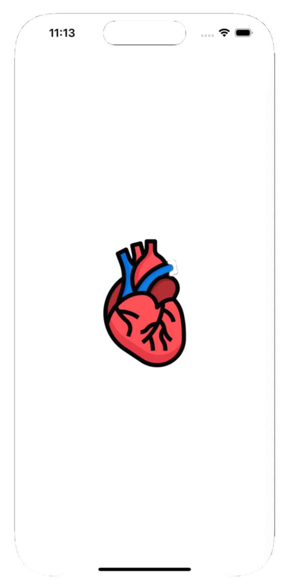
 
  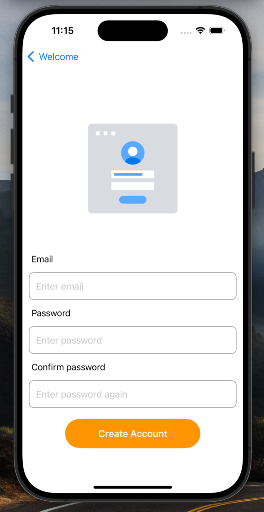
   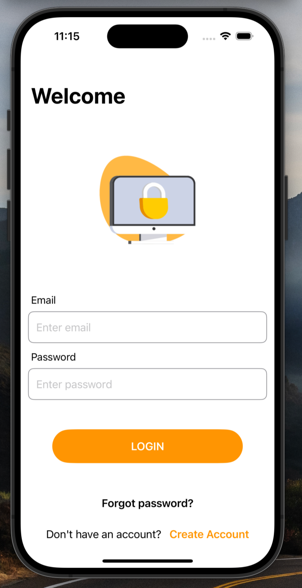
   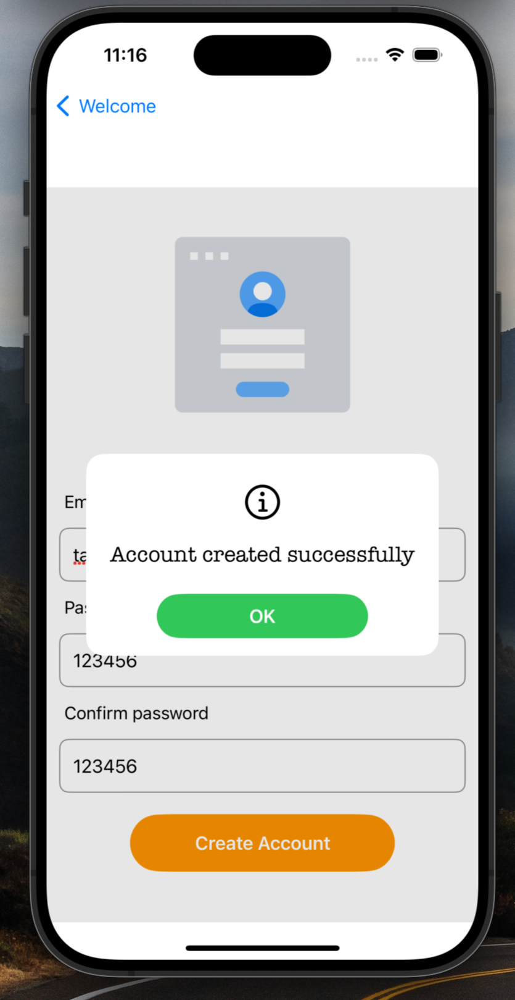
   

---

## Displaying the recorded health information with filter

  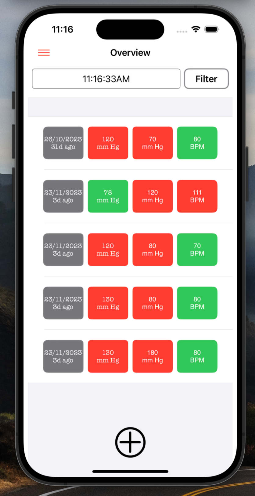
  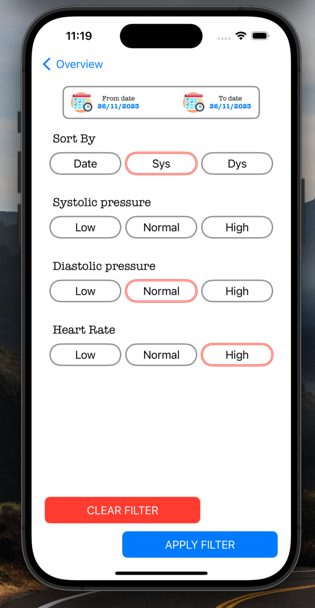
  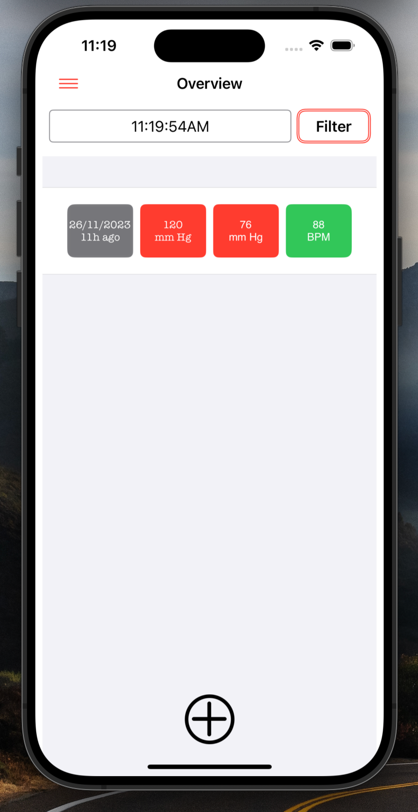
  
 

---

## Storing health update information

  
  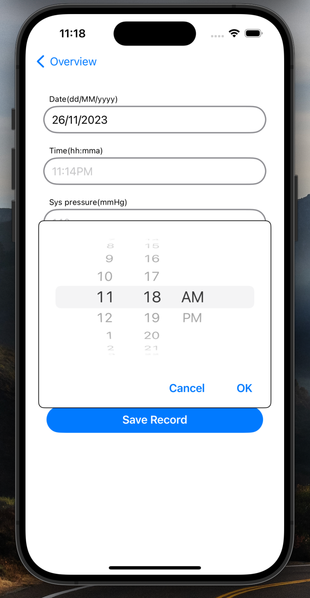
  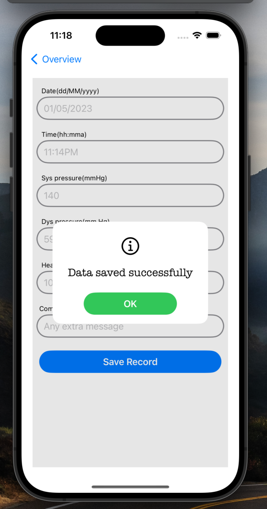
  

---

## BMI Calculation

  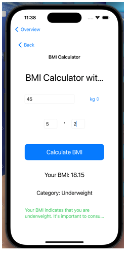
 

---

## API integration which shows different disease information in the details view

  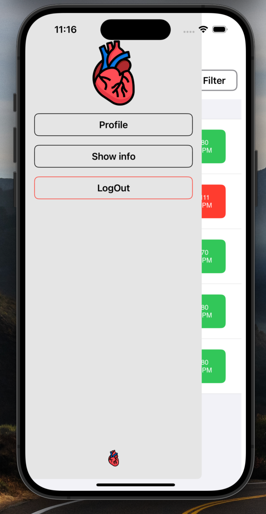
  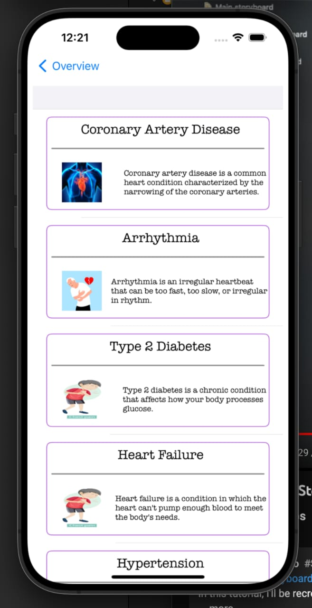

---

