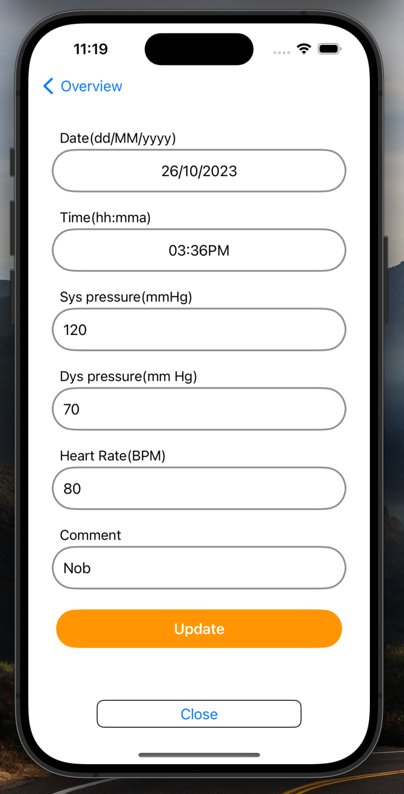

# 🩺 Health Tracker

A comprehensive Health Tracker app that helps users monitor their fitness, medical stats, and progress through a simple and intuitive interface.

---

## 📸 Screenshots

Below are some visual previews of the app interface and features:

  
 
  
   
   
   

  
  
  
  
 

  
  
  
  

  
  

> 🔁 Add or remove image rows as needed, based on how many screenshots you have.

---

## 🧠 Features

- Track daily health metrics
- Visual charts and insights
- Reminders for medications and activities
- Clean and responsive UI

---

## 📁 Folder Structure

